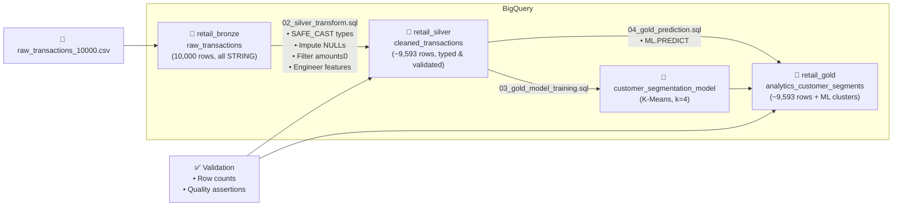

# 🏗️ Retail Data Pipeline — Medallion Architecture on BigQuery

A production-grade data pipeline implementing the **Bronze → Silver → Gold** Medallion Architecture pattern in Google BigQuery, with native **BQML K-Means clustering** for customer segmentation.

## 📐 Architecture Overview



## 📁 Repository Structure

```
├── sql/
│   ├── 01_bronze_ingestion.sql         # DDL + data loading instructions
│   ├── 02_silver_transform.sql         # CTE-based cleansing pipeline
│   ├── 03_gold_model_training.sql      # K-Means model training
│   ├── 04_gold_prediction.sql          # ML.PREDICT → final analytics table
│   └── 05_gold_model_evaluation.sql    # ML.EVALUATE + ML.CENTROIDS
├── validation/
│   ├── row_count_checks.sql            # Cross-layer row reconciliation
│   └── data_quality_checks.sql         # Named assertion checks
├── proof/                              # BigQuery console screenshots
│   ├── gold_table_schema.png           # Schema of analytics_customer_segments
│   ├── gold_table_preview.png          # Data preview rows
│   └── model_evaluation.png            # BQML evaluation metrics
├── data/
│   └── raw_transactions_10000.csv      # Source dataset
└── README.md                           # This file
```

**Execution order**: Run the SQL files in numbered sequence (`01` → `02` → `03` → `04` → `05`), then run the validation scripts.

---

## 🔍 Data Profiling & Quality Findings

Before writing any transformations, I profiled the raw dataset to understand its quality issues. This discovery phase informed every design decision in the pipeline.

| Column | Finding | Impact | Silver Layer Fix |
|---|---|---|---|
| `signup_date` | **823 rows (8.2%)** contain the literal string `"NULL"` — not a SQL NULL | Would fail `CAST(... AS DATE)` | `NULLIF(val, 'NULL')` → `COALESCE(signup_date, purchase_date)` |
| `is_returned` | **1,009 rows (10.1%)** contain string `"NULL"` | Would fail `CAST(... AS BOOL)` | `NULLIF(val, 'NULL')` → `IFNULL(is_returned, FALSE)` |
| `amount` | **407 rows (4.1%)** have values ≤ 0 (min: -149.65) | Negatives skew K-means clusters | Filter `WHERE amount > 0` |
| `purchase_date` | All 10,000 rows present, consistent `YYYY-MM-DD` format | ✅ Clean | `SAFE_CAST` as safety net |
| `item_category` | 6 balanced categories (~1,650 each) | ✅ Clean | `TRIM()` for safety |
| `transaction_id` | 0 duplicates | ✅ Clean | — |
| `signup > purchase` | 0 occurrences | ✅ No negative day gaps | — |

**Post-filtering**: ~9,593 clean rows proceed to the Silver layer.

---

## 🧠 Design Decisions

### 1. SAFE_CAST Over CAST
`SAFE_CAST` returns `NULL` on conversion failure instead of throwing an error. This means a single malformed row won't crash the entire pipeline — critical for production resilience.

### 2. CTE Pipeline Architecture
The Silver transform uses a 5-step CTE chain (`source → cast → impute → filter → enrich`). Each step is:
- **Independently testable**: Comment out the final `SELECT` and query any intermediate CTE
- **Self-documenting**: Step names describe the transformation intent
- **Interview-friendly**: Walk through top-to-bottom like a story

### 3. Feature Standardisation in K-Means
`standardize_features = TRUE` is essential. Without it, the `amount` column (range 0–1200) dominates Euclidean distance calculations, and the one-hot encoded `item_category` (0/1) would have negligible influence. Standardisation puts all features on equal footing.

### 4. Cluster Count (k=4)
Started with k=4 as a pragmatic baseline for retail segmentation. The `05_gold_model_evaluation.sql` script includes ML.EVALUATE to validate this choice via the Davies-Bouldin Index. In production, I would run an elbow analysis (k=2 to k=8) to find the optimal k empirically.

### 5. Table Partitioning & Clustering
- **Partitioned by `purchase_date`**: Enables partition pruning for time-range queries and controls storage costs. Dataset/table expiration defaults were cleared before creating the partitioned tables so the historical assessment partitions are retained.
- **Clustered by `item_category`** (Silver) and `customer_segment, item_category`** (Gold): Speeds up filtered scans for the most common query patterns

### 6. Validation as a First-Class Concern
The `validation/` folder contains:
- **Row count reconciliation**: Ensures every row is accounted for across layers — either it passed through or was explicitly filtered
- **Named quality assertions**: 10 checks following the dbt/Great Expectations pattern, verifiable with a single query

---

## 🔄 Pipeline Orchestration (Production Recommendation)

### Recommended: Dataform (Google Cloud Native)

For a pipeline that lives entirely within BigQuery, **Dataform** is the strongest choice. It is Google Cloud's native SQL-based orchestration framework, purpose-built for BigQuery:

- **Declarative dependency management**: Define table dependencies via `ref()` functions — Dataform automatically determines execution order and parallelises independent steps
- **Built-in testing**: Assertion blocks can replace the manual `validation/` folder, running data quality checks as part of every pipeline execution
- **Version control integration**: Dataform projects are Git-native, making CI/CD straightforward
- **Incremental builds**: Supports incremental materialisation for Silver/Gold tables, avoiding full reprocessing on each run
- **Environments**: Separate dev/staging/prod with environment-specific dataset suffixes

**Example Dataform dependency graph** for this pipeline:
```
raw_transactions (source)
  └── cleaned_transactions (Silver)
        ├── customer_segmentation_model (Gold / ML)
        │     └── analytics_customer_segments (Gold / Prediction)
        └── [assertion] no_null_amounts
        └── [assertion] no_duplicate_txn_ids
```

### Alternative: Cloud Composer (Apache Airflow)

For organisations with more complex orchestration needs (cross-system dependencies, external API calls, non-SQL steps), **Cloud Composer** provides:
- Full DAG-based workflow orchestration
- BigQuery operators for SQL execution
- Sensor operators for file arrival detection (e.g., waiting for a new CSV in GCS)
- Integration with Pub/Sub, Dataflow, Cloud Functions for event-driven pipelines

**Trade-off**: Composer introduces infrastructure overhead (managed Airflow environment) and is overkill for a pure SQL-in-BigQuery pipeline, but becomes necessary when the pipeline spans multiple systems.

### Scheduling

In either tool, this pipeline would run on a **daily schedule** (or triggered by file arrival in GCS), with:
- **Alerting**: Slack/email notifications on failure
- **SLA monitoring**: Track pipeline completion time
- **Retry logic**: Automatic retry with exponential backoff on transient failures

---

## 🤖 AI Tools Used

The following AI tools assisted in developing this pipeline:

- **ChatGPT / Codex (OpenAI)**: Used for SQL review, BigQuery debugging, documentation refinement, and repository cleanup
- **Gemini (Google AI)**: Used for initial planning, data profiling strategy, and BigQuery syntax reference

AI was used as a **pair-programming partner** — all design decisions, data quality observations, and architectural choices were reviewed and validated by the developer. The AI accelerated implementation but did not replace engineering judgement.

---

## 🚀 How to Run

1. **Set up GCP**: Create a project with BigQuery enabled. Free tier includes 1TB query/month and 10GB storage.

2. **Execute scripts in order**:
   ```
   01_bronze_ingestion.sql    →  Creates schema + table, load CSV
   02_silver_transform.sql    →  Creates cleaned Silver table
   03_gold_model_training.sql →  Trains K-Means model (~1-2 min)
   04_gold_prediction.sql     →  Creates final Gold table with segments
   05_gold_model_evaluation.sql → Evaluates model (screenshot results)
   ```

3. **Run validation**:
   ```
   validation/row_count_checks.sql     →  Verify row counts match
   validation/data_quality_checks.sql  →  All assertions should pass
   ```

4. **Capture proof**: Take screenshots from the BigQuery Console and place in `/proof`:
   - Gold table schema & preview
   - Model evaluation metrics (from Console's "Evaluation" tab or `05_gold_model_evaluation.sql` output)
