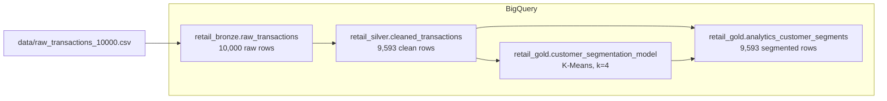

# Retail Data Pipeline on BigQuery

This repository contains a BigQuery-based data pipeline for the Incubeta Data Engineering Screening Challenge. It implements a Bronze, Silver, and Gold medallion flow and uses BigQuery ML K-Means clustering to assign customer segments.

## Pipeline Summary

The source file is loaded into BigQuery as raw strings, transformed into a typed and validated Silver table, then used to train and apply a BQML clustering model.



## Repository Structure

```text
.
|-- data/
|   `-- raw_transactions_10000.csv
|-- proof/
|   |-- gold_table_preview.png
|   |-- gold_table_schema.png
|   `-- model_evaluation.png
|-- sql/
|   |-- 01_bronze_ingestion.sql
|   |-- 02_silver_transform.sql
|   |-- 03_gold_model_training.sql
|   |-- 04_gold_prediction.sql
|   `-- 05_gold_model_evaluation.sql
|-- validation/
|   |-- data_quality_checks.sql
|   `-- row_count_checks.sql
`-- README.md
```

## Execution Order

Run the SQL scripts in this order:

1. `sql/01_bronze_ingestion.sql`
2. `sql/02_silver_transform.sql`
3. `sql/03_gold_model_training.sql`
4. `sql/04_gold_prediction.sql`
5. `sql/05_gold_model_evaluation.sql`

Then run:

1. `validation/row_count_checks.sql`
2. `validation/data_quality_checks.sql`

## Layer Details

### Bronze

`retail_bronze.raw_transactions` stores the CSV as received. All columns are loaded as `STRING` so the raw source values are preserved for profiling and downstream cleansing.

Expected row count:

```text
10,000 rows
```

### Silver

`retail_silver.cleaned_transactions` applies the cleansing and transformation rules required by the assessment:

- Casts dates to `DATE`
- Casts `amount` to `NUMERIC`
- Converts literal `"NULL"` values before casting
- Defaults missing `signup_date` to `purchase_date`
- Defaults missing `is_returned` to `FALSE`
- Filters out transactions where `amount <= 0`
- Adds `days_to_first_purchase`

Expected row count:

```text
9,593 rows
```

The table is partitioned by `purchase_date` and clustered by `item_category`.

### Gold

`retail_gold.customer_segmentation_model` is a BigQuery ML K-Means model trained on:

- `amount`
- `item_category`

`retail_gold.analytics_customer_segments` applies the model with `ML.PREDICT` and stores the original clean transaction fields plus `customer_segment`.

The final Gold table is partitioned by `purchase_date` and clustered by `customer_segment, item_category`.

Expected row count:

```text
9,593 rows
```

## Data Quality Findings

| Column | Finding | Handling |
| --- | --- | --- |
| `signup_date` | 823 literal `"NULL"` values | Convert to SQL NULL, then default to `purchase_date` |
| `is_returned` | 1,009 literal `"NULL"` values | Convert to SQL NULL, then default to `FALSE` |
| `amount` | 407 values are `<= 0` | Exclude from Silver |
| `purchase_date` | Valid date strings in source data | Cast with `SAFE_CAST` |
| `transaction_id` | No duplicates found | Validate in quality checks |

## Model Evaluation

The trained model was evaluated with `ML.EVALUATE`.

| Metric | Value |
| --- | ---: |
| `davies_bouldin_index` | 2.1797404818696244 |
| `mean_squared_distance` | 0.90840111109909 |

The resulting customer segments are mainly separated by spend level:

| Segment | Rows | Average amount |
| --- | ---: | ---: |
| 1 | 2,238 | 593.76 |
| 2 | 2,357 | 1047.95 |
| 3 | 3,347 | 220.55 |
| 4 | 1,651 | 774.34 |

## Validation

The validation scripts check:

- Bronze, Silver, and Gold row reconciliation
- Non-null key fields
- Positive transaction amounts
- Valid item categories
- No duplicate transaction IDs
- Non-null customer segment assignments in Gold

Expected validation result: all data quality checks pass with zero violations.

## BigQuery Retention Note

The assessment data contains historical `purchase_date` values. BigQuery Sandbox applies a 60-day table and partition expiration by default, which can cause historical partitions to expire immediately. Before creating the partitioned Silver and Gold tables, dataset/table expiration defaults were cleared so the partitions are retained.

If needed, clear those defaults before running the Silver and Gold scripts:

```sql
ALTER SCHEMA `incubeta-de-screening.retail_silver`
SET OPTIONS (
  default_table_expiration_days = NULL,
  default_partition_expiration_days = NULL
);

ALTER SCHEMA `incubeta-de-screening.retail_gold`
SET OPTIONS (
  default_table_expiration_days = NULL,
  default_partition_expiration_days = NULL
);
```

## Production Orchestration Recommendation

For a BigQuery-native production pipeline, Dataform would be the preferred orchestration option. It supports SQL-based dependency management, assertions, incremental models, environment configuration, and Git-based deployment.

Cloud Composer would be a stronger option if the workflow needed cross-system orchestration, external sensors, or non-SQL processing steps.

In production, the pipeline would run on a scheduled cadence or be triggered by source-file arrival in Cloud Storage, with alerting, retries, and SLA monitoring.

## Proof of Execution

The `proof/` directory contains:

- `gold_table_schema.png`: final Gold table schema
- `gold_table_preview.png`: final Gold table preview rows
- `model_evaluation.png`: BQML evaluation metrics

## AI Tools Used

AI tools were used as pair-programming support. The final implementation, validation, and design choices were reviewed before submission.

- ChatGPT / Codex: SQL review, BigQuery troubleshooting, documentation cleanup, and repository refinement
- Gemini: initial planning, data profiling strategy, and BigQuery syntax reference
